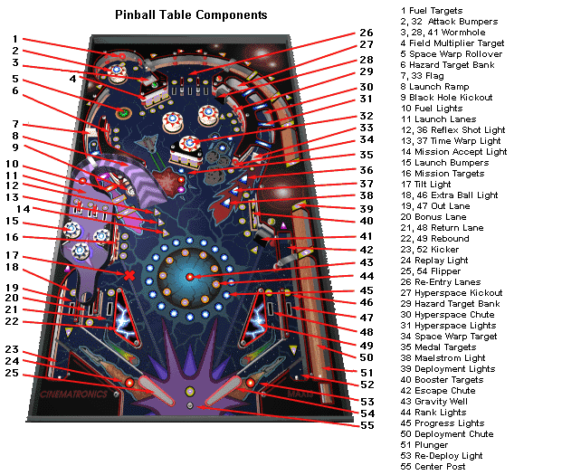

Pinball
================

Pinball code written for MCO-364 with students:

Ayelet Buchen https://github.com/ayeletbuchen

Sarah Bracha Schuraytz https://github.com/sschuraytz

Esther Gassner https://github.com/esthergassner

Helen Sutton https://github.com/HelenSutton

Kaila Minkowitz https://github.com/kailamink

Containing some, but not all, of the components below:
